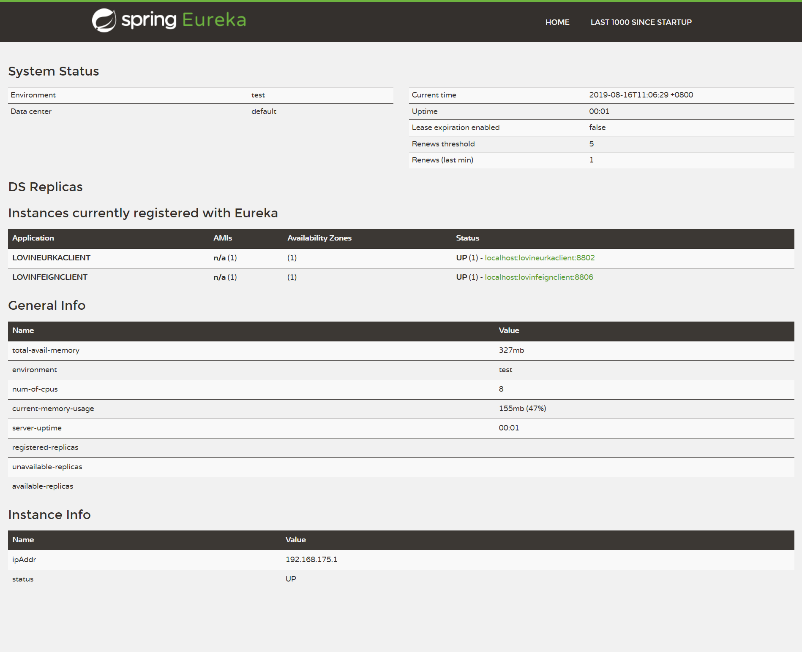
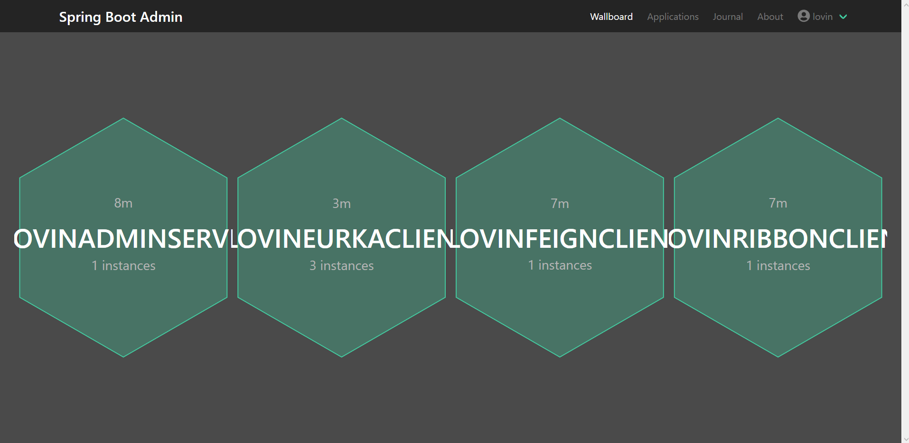
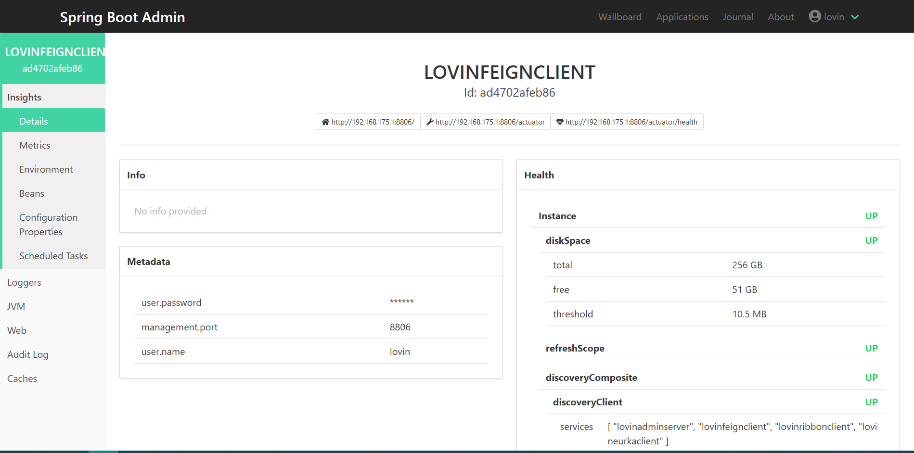

# lovinCloud 

* 一个简单springcloud的实践
* springboot-admin监控springcloud集群，并且用spring-boot-starter-security做了安全
* springcloud常用组件使用

---

## 技术栈

* spring-cloud-starter-netflix-eureka-server
* spring-cloud-starter-netflix-eureka-client
* spring-cloud-starter-netflix-ribbon
* spring-cloud-starter-openfeign
* spring-cloud-starter-hystrix
* spring-boot-admin-starter-client
* spring-boot-admin-starter-server
* spring-cloud-netflix-turbine

## Tips

* 为了测试负载均衡，我们可以用idea启动多个eurekaclient

# License
Released under the [MIT](LICENSE) License.
