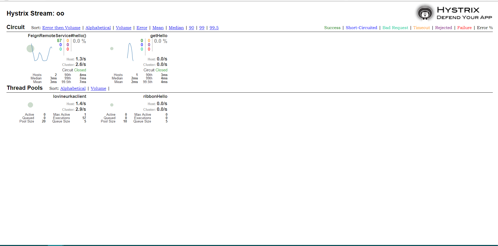
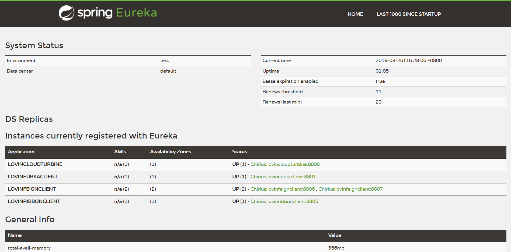

# lovinCloud 

* turbine,聚合监控hystrix情况

* **注意事项**：监控的服务的groupkey不能重复，不然会被认为是同一个监控项目

## 另外监控还可以通过消息队列来做到异步监控，下面就说一下具体改造步骤：

### turbine服务端修改

* 修改pom依赖

~~~pom
<dependencies>
        <dependency>
            <groupId>org.springframework.cloud</groupId>
            <artifactId>spring-cloud-starter-netflix-eureka-client</artifactId>
        </dependency>
        <dependency>
            <groupId>org.springframework.boot</groupId>
            <artifactId>spring-boot-starter-security</artifactId>
        </dependency>
        <dependency>
            <groupId>org.springframework.boot</groupId>
            <artifactId>spring-boot-starter-web</artifactId>
        </dependency>
        <dependency>
            <groupId>de.codecentric</groupId>
            <artifactId>spring-boot-admin-starter-client</artifactId>
            <version>2.1.6</version>
        </dependency>
        <dependency>
            <groupId>org.springframework.cloud</groupId>
            <artifactId>spring-cloud-starter-turbine</artifactId>
            <version>1.4.7.RELEASE</version>
        </dependency>
        <dependency>
            <groupId>org.springframework.cloud</groupId>
            <artifactId>spring-cloud-netflix-turbine</artifactId>
        </dependency>
        <dependency>
            <groupId>org.springframework.boot</groupId>
            <artifactId>spring-boot-starter-actuator</artifactId>
        </dependency>
        <dependency>
            <groupId>org.springframework.cloud</groupId>
            <artifactId>spring-cloud-starter-turbine-amqp</artifactId>
            <version>1.4.7.RELEASE</version>
        </dependency>
    </dependencies>

    <build>
        <plugins>
            <plugin>
                <groupId>org.springframework.boot</groupId>
                <artifactId>spring-boot-maven-plugin</artifactId>
            </plugin>
        </plugins>
    </build>
~~~

可以看到这里主要引入了spring-cloud-starter-turbine-amqp依赖，它实际上就是包装了spring-cloud-starter-turbine-stream和pring-cloud-starter-stream-rabbit。

* 添加连接rabbitmq配置

~~~yaml
spring:
  rabbitmq:
    host: 127.0.0.1
    port: 5672
    username: guest
    password: guest
~~~

* 在应用主类中使用@EnableTurbineStream注解来启用Turbine Stream的配置

~~~java
package com.eelve.lovin;

import org.springframework.boot.SpringApplication;
import org.springframework.boot.autoconfigure.SpringBootApplication;
import org.springframework.cloud.client.discovery.EnableDiscoveryClient;
import org.springframework.cloud.netflix.turbine.EnableTurbine;
import org.springframework.cloud.netflix.turbine.stream.EnableTurbineStream;

/**
 * @ClassName LovinCloudTurbineApplication
 * @Description TDO
 * @Author zhao.zhilue
 * @Date 2019/8/25 17:17
 * @Version 1.0
 *
 **/
@SpringBootApplication
@EnableDiscoveryClient
@EnableTurbineStream
public class LovinCloudTurbineApplication {
    public static void main(String[] args) {
        SpringApplication.run(LovinCloudTurbineApplication.class,args);
    }
}
~~~

### 对服务消费者进行修改

* 添加**spring-cloud-netflix-hystrix-amqp**依赖

~~~pom
	<dependency>
		<groupId>org.springframework.cloud</groupId>
		<artifactId>spring-cloud-netflix-hystrix-amqp</artifactId>
        <version>1.4.7.RELEASE</version>
	</dependency>
~~~

* 添加连接rabbitmq配置

~~~yaml
spring:
  rabbitmq:
    host: 127.0.0.1
    port: 5672
    username: guest
    password: guest
~~~

## 然后重启服务之后，就可以再次看到监控详情

