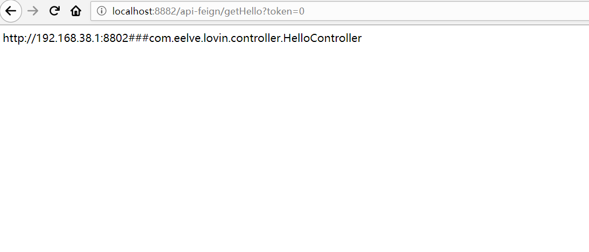
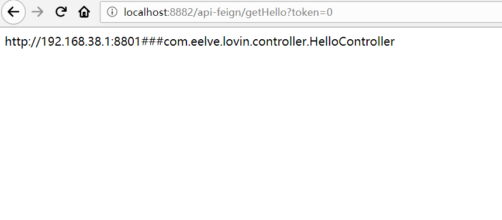
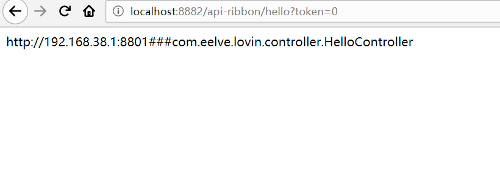
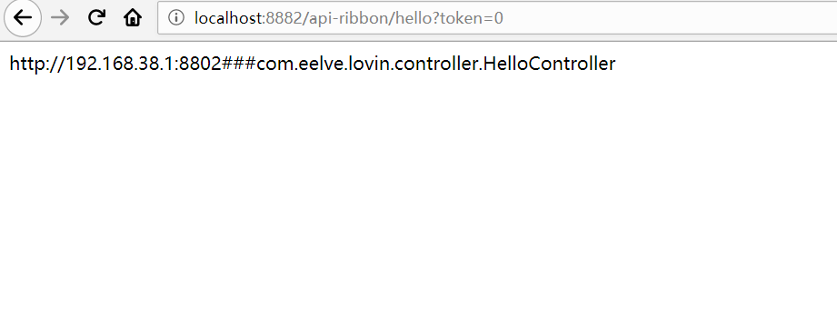
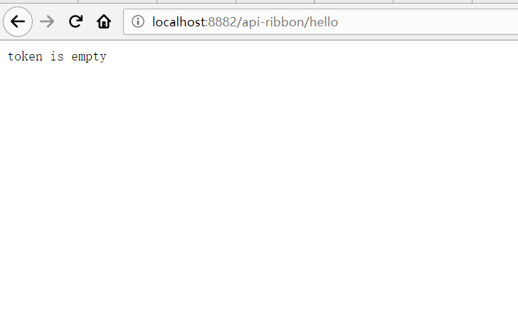

# lovincloudzuul 

* 通过网关转发服务,分别到lovinribbonclient进行分发和lovinfeignclient分发
```yaml
zuul:
  routes:
    api-ribbon:
      path: /api-ribbon/**
      serviceId: lovinribbonclient
    api-feign:
      path: /api-feign/**
      serviceId: lovinfeignclient
```
* 服务过滤,自定义filter

~~~java
package com.eelve.lovin.filter;

import com.netflix.zuul.ZuulFilter;
import com.netflix.zuul.context.RequestContext;
import com.netflix.zuul.exception.ZuulException;
import lombok.extern.slf4j.Slf4j;
import org.springframework.stereotype.Component;

import javax.servlet.http.HttpServletRequest;

/**
 * @ClassName MyFilter
 * @Description TDO
 * @Author zhao.zhilue
 * @Date 2019/8/18 12:44
 * @Version 1.0
 **/
@Component
@Slf4j
public class MyFilter extends ZuulFilter {
    @Override
    public String filterType() {
        return "pre";
    }

    @Override
    public int filterOrder() {
        return 0;
    }

    @Override
    public boolean shouldFilter() {
        return true;
    }

    @Override
    public Object run() throws ZuulException {
        RequestContext ctx = RequestContext.getCurrentContext();
        HttpServletRequest request = ctx.getRequest();
        log.info(String.format("%s >>> %s", request.getMethod(), request.getRequestURL().toString()));
        Object accessToken = request.getParameter("token");
        if(accessToken == null) {
            log.warn("token is empty");
            ctx.setSendZuulResponse(false);
            ctx.setResponseStatusCode(401);
            try {
                ctx.getResponse().getWriter().write("token is empty");
            }catch (Exception e){}

            return null;
        }
        log.info("ok");
        return null;
    }
}
~~~
~~~
    filterType：返回一个字符串代表过滤器的类型，在zuul中定义了四种不同生命周期的过滤器类型，具体如下：
        pre：路由之前
        routing：路由之时
        post： 路由之后
        error：发送错误调用
    filterOrder：过滤的顺序
    shouldFilter：这里可以写逻辑判断，是否要过滤，本文true,永远过滤。
    run：过滤器的具体逻辑。可用很复杂，包括查sql，nosql去判断该请求到底有没有权限访问。
~~~

* 下面是具体的截图，分别展示了负载均衡和路由过滤








* 下面是具体的日志，供参考

~~~
"C:\Program Files\Java\jdk1.8.0_161\bin\java.exe" -XX:TieredStopAtLevel=1 -noverify -Dspring.output.ansi.enabled=always -Dcom.sun.management.jmxremote -Dspring.jmx.enabled=true -Dspring.liveBeansView.mbeanDomain -Dspring.application.admin.enabled=true "-javaagent:C:\Program Files\JetBrains\IntelliJ IDEA 2019.1\lib\idea_rt.jar=14390:C:\Program Files\JetBrains\IntelliJ IDEA 2019.1\bin" -Dfile.encoding=UTF-8 -classpath "C:\Program Files\Java\jdk1.8.0_161\jre\lib\charsets.jar;C:\Program Files\Java\jdk1.8.0_161\jre\lib\deploy.jar;C:\Program Files\Java\jdk1.8.0_161\jre\lib\ext\access-bridge-64.jar;C:\Program Files\Java\jdk1.8.0_161\jre\lib\ext\cldrdata.jar;C:\Program Files\Java\jdk1.8.0_161\jre\lib\ext\dnsns.jar;C:\Program Files\Java\jdk1.8.0_161\jre\lib\ext\jaccess.jar;C:\Program Files\Java\jdk1.8.0_161\jre\lib\ext\jfxrt.jar;C:\Program Files\Java\jdk1.8.0_161\jre\lib\ext\localedata.jar;C:\Program Files\Java\jdk1.8.0_161\jre\lib\ext\nashorn.jar;C:\Program Files\Java\jdk1.8.0_161\jre\lib\ext\sunec.jar;C:\Program Files\Java\jdk1.8.0_161\jre\lib\ext\sunjce_provider.jar;C:\Program Files\Java\jdk1.8.0_161\jre\lib\ext\sunmscapi.jar;C:\Program Files\Java\jdk1.8.0_161\jre\lib\ext\sunpkcs11.jar;C:\Program Files\Java\jdk1.8.0_161\jre\lib\ext\zipfs.jar;C:\Program Files\Java\jdk1.8.0_161\jre\lib\javaws.jar;C:\Program Files\Java\jdk1.8.0_161\jre\lib\jce.jar;C:\Program Files\Java\jdk1.8.0_161\jre\lib\jfr.jar;C:\Program Files\Java\jdk1.8.0_161\jre\lib\jfxswt.jar;C:\Program Files\Java\jdk1.8.0_161\jre\lib\jsse.jar;C:\Program Files\Java\jdk1.8.0_161\jre\lib\management-agent.jar;C:\Program Files\Java\jdk1.8.0_161\jre\lib\plugin.jar;C:\Program Files\Java\jdk1.8.0_161\jre\lib\resources.jar;C:\Program Files\Java\jdk1.8.0_161\jre\lib\rt.jar;D:\iios\lovincloud\lovin-cloud-zuul\target\classes;C:\Users\Chirius\.m2\repository\org\springframework\cloud\spring-cloud-starter-netflix-eureka-client\2.1.2.RELEASE\spring-cloud-starter-netflix-eureka-client-2.1.2.RELEASE.jar;C:\Users\Chirius\.m2\repository\org\springframework\cloud\spring-cloud-starter\2.1.2.RELEASE\spring-cloud-starter-2.1.2.RELEASE.jar;C:\Users\Chirius\.m2\repository\org\springframework\cloud\spring-cloud-context\2.1.2.RELEASE\spring-cloud-context-2.1.2.RELEASE.jar;C:\Users\Chirius\.m2\repository\org\springframework\security\spring-security-crypto\5.1.6.RELEASE\spring-security-crypto-5.1.6.RELEASE.jar;C:\Users\Chirius\.m2\repository\org\springframework\cloud\spring-cloud-commons\2.1.2.RELEASE\spring-cloud-commons-2.1.2.RELEASE.jar;C:\Users\Chirius\.m2\repository\org\springframework\security\spring-security-rsa\1.0.7.RELEASE\spring-security-rsa-1.0.7.RELEASE.jar;C:\Users\Chirius\.m2\repository\org\bouncycastle\bcpkix-jdk15on\1.60\bcpkix-jdk15on-1.60.jar;C:\Users\Chirius\.m2\repository\org\bouncycastle\bcprov-jdk15on\1.60\bcprov-jdk15on-1.60.jar;C:\Users\Chirius\.m2\repository\org\springframework\cloud\spring-cloud-netflix-hystrix\2.1.2.RELEASE\spring-cloud-netflix-hystrix-2.1.2.RELEASE.jar;C:\Users\Chirius\.m2\repository\org\springframework\boot\spring-boot-autoconfigure\2.1.7.RELEASE\spring-boot-autoconfigure-2.1.7.RELEASE.jar;C:\Users\Chirius\.m2\repository\org\springframework\boot\spring-boot-starter-aop\2.1.7.RELEASE\spring-boot-starter-aop-2.1.7.RELEASE.jar;C:\Users\Chirius\.m2\repository\org\aspectj\aspectjweaver\1.9.4\aspectjweaver-1.9.4.jar;C:\Users\Chirius\.m2\repository\org\springframework\cloud\spring-cloud-netflix-eureka-client\2.1.2.RELEASE\spring-cloud-netflix-eureka-client-2.1.2.RELEASE.jar;C:\Users\Chirius\.m2\repository\com\netflix\eureka\eureka-client\1.9.12\eureka-client-1.9.12.jar;C:\Users\Chirius\.m2\repository\org\codehaus\jettison\jettison\1.3.7\jettison-1.3.7.jar;C:\Users\Chirius\.m2\repository\stax\stax-api\1.0.1\stax-api-1.0.1.jar;C:\Users\Chirius\.m2\repository\com\netflix\netflix-commons\netflix-eventbus\0.3.0\netflix-eventbus-0.3.0.jar;C:\Users\Chirius\.m2\repository\com\netflix\netflix-commons\netflix-infix\0.3.0\netflix-infix-0.3.0.jar;C:\Users\Chirius\.m2\repository\commons-jxpath\commons-jxpath\1.3\commons-jxpath-1.3.jar;C:\Users\Chirius\.m2\repository\joda-time\joda-time\2.10.3\joda-time-2.10.3.jar;C:\Users\Chirius\.m2\repository\org\antlr\antlr-runtime\3.4\antlr-runtime-3.4.jar;C:\Users\Chirius\.m2\repository\org\antlr\stringtemplate\3.2.1\stringtemplate-3.2.1.jar;C:\Users\Chirius\.m2\repository\antlr\antlr\2.7.7\antlr-2.7.7.jar;C:\Users\Chirius\.m2\repository\com\google\code\gson\gson\2.8.5\gson-2.8.5.jar;C:\Users\Chirius\.m2\repository\org\apache\commons\commons-math\2.2\commons-math-2.2.jar;C:\Users\Chirius\.m2\repository\com\netflix\archaius\archaius-core\0.7.6\archaius-core-0.7.6.jar;C:\Users\Chirius\.m2\repository\com\google\guava\guava\16.0\guava-16.0.jar;C:\Users\Chirius\.m2\repository\javax\ws\rs\jsr311-api\1.1.1\jsr311-api-1.1.1.jar;C:\Users\Chirius\.m2\repository\com\netflix\servo\servo-core\0.12.21\servo-core-0.12.21.jar;C:\Users\Chirius\.m2\repository\com\sun\jersey\jersey-core\1.19.1\jersey-core-1.19.1.jar;C:\Users\Chirius\.m2\repository\com\sun\jersey\jersey-client\1.19.1\jersey-client-1.19.1.jar;C:\Users\Chirius\.m2\repository\com\sun\jersey\contribs\jersey-apache-client4\1.19.1\jersey-apache-client4-1.19.1.jar;C:\Users\Chirius\.m2\repository\org\apache\httpcomponents\httpclient\4.5.9\httpclient-4.5.9.jar;C:\Users\Chirius\.m2\repository\org\apache\httpcomponents\httpcore\4.4.11\httpcore-4.4.11.jar;C:\Users\Chirius\.m2\repository\commons-codec\commons-codec\1.11\commons-codec-1.11.jar;C:\Users\Chirius\.m2\repository\com\google\inject\guice\4.1.0\guice-4.1.0.jar;C:\Users\Chirius\.m2\repository\javax\inject\javax.inject\1\javax.inject-1.jar;C:\Users\Chirius\.m2\repository\aopalliance\aopalliance\1.0\aopalliance-1.0.jar;C:\Users\Chirius\.m2\repository\com\github\vlsi\compactmap\compactmap\1.2.1\compactmap-1.2.1.jar;C:\Users\Chirius\.m2\repository\com\github\andrewoma\dexx\dexx-collections\0.2\dexx-collections-0.2.jar;C:\Users\Chirius\.m2\repository\com\fasterxml\jackson\core\jackson-annotations\2.9.0\jackson-annotations-2.9.0.jar;C:\Users\Chirius\.m2\repository\com\fasterxml\jackson\core\jackson-core\2.9.9\jackson-core-2.9.9.jar;C:\Users\Chirius\.m2\repository\com\fasterxml\jackson\core\jackson-databind\2.9.9\jackson-databind-2.9.9.jar;C:\Users\Chirius\.m2\repository\com\netflix\eureka\eureka-core\1.9.12\eureka-core-1.9.12.jar;C:\Users\Chirius\.m2\repository\com\fasterxml\woodstox\woodstox-core\5.0.3\woodstox-core-5.0.3.jar;C:\Users\Chirius\.m2\repository\org\codehaus\woodstox\stax2-api\3.1.4\stax2-api-3.1.4.jar;C:\Users\Chirius\.m2\repository\org\springframework\cloud\spring-cloud-starter-netflix-archaius\2.1.2.RELEASE\spring-cloud-starter-netflix-archaius-2.1.2.RELEASE.jar;C:\Users\Chirius\.m2\repository\org\springframework\cloud\spring-cloud-netflix-ribbon\2.1.2.RELEASE\spring-cloud-netflix-ribbon-2.1.2.RELEASE.jar;C:\Users\Chirius\.m2\repository\org\springframework\cloud\spring-cloud-netflix-archaius\2.1.2.RELEASE\spring-cloud-netflix-archaius-2.1.2.RELEASE.jar;C:\Users\Chirius\.m2\repository\commons-configuration\commons-configuration\1.8\commons-configuration-1.8.jar;C:\Users\Chirius\.m2\repository\commons-lang\commons-lang\2.6\commons-lang-2.6.jar;C:\Users\Chirius\.m2\repository\org\springframework\cloud\spring-cloud-starter-netflix-ribbon\2.1.2.RELEASE\spring-cloud-starter-netflix-ribbon-2.1.2.RELEASE.jar;C:\Users\Chirius\.m2\repository\com\netflix\ribbon\ribbon\2.3.0\ribbon-2.3.0.jar;C:\Users\Chirius\.m2\repository\com\netflix\ribbon\ribbon-transport\2.3.0\ribbon-transport-2.3.0.jar;C:\Users\Chirius\.m2\repository\io\reactivex\rxnetty-contexts\0.4.9\rxnetty-contexts-0.4.9.jar;C:\Users\Chirius\.m2\repository\io\reactivex\rxnetty-servo\0.4.9\rxnetty-servo-0.4.9.jar;C:\Users\Chirius\.m2\repository\com\netflix\hystrix\hystrix-core\1.5.18\hystrix-core-1.5.18.jar;C:\Users\Chirius\.m2\repository\org\hdrhistogram\HdrHistogram\2.1.9\HdrHistogram-2.1.9.jar;C:\Users\Chirius\.m2\repository\io\reactivex\rxnetty\0.4.9\rxnetty-0.4.9.jar;C:\Users\Chirius\.m2\repository\com\netflix\ribbon\ribbon-core\2.3.0\ribbon-core-2.3.0.jar;C:\Users\Chirius\.m2\repository\com\netflix\ribbon\ribbon-httpclient\2.3.0\ribbon-httpclient-2.3.0.jar;C:\Users\Chirius\.m2\repository\commons-collections\commons-collections\3.2.2\commons-collections-3.2.2.jar;C:\Users\Chirius\.m2\repository\com\netflix\netflix-commons\netflix-commons-util\0.3.0\netflix-commons-util-0.3.0.jar;C:\Users\Chirius\.m2\repository\com\netflix\ribbon\ribbon-loadbalancer\2.3.0\ribbon-loadbalancer-2.3.0.jar;C:\Users\Chirius\.m2\repository\com\netflix\netflix-commons\netflix-statistics\0.1.1\netflix-statistics-0.1.1.jar;C:\Users\Chirius\.m2\repository\io\reactivex\rxjava\1.3.8\rxjava-1.3.8.jar;C:\Users\Chirius\.m2\repository\com\netflix\ribbon\ribbon-eureka\2.3.0\ribbon-eureka-2.3.0.jar;C:\Users\Chirius\.m2\repository\org\slf4j\slf4j-api\1.7.26\slf4j-api-1.7.26.jar;C:\Users\Chirius\.m2\repository\com\thoughtworks\xstream\xstream\1.4.10\xstream-1.4.10.jar;C:\Users\Chirius\.m2\repository\xmlpull\xmlpull\1.1.3.1\xmlpull-1.1.3.1.jar;C:\Users\Chirius\.m2\repository\xpp3\xpp3_min\1.1.4c\xpp3_min-1.1.4c.jar;C:\Users\Chirius\.m2\repository\org\springframework\boot\spring-boot-starter-security\2.1.7.RELEASE\spring-boot-starter-security-2.1.7.RELEASE.jar;C:\Users\Chirius\.m2\repository\org\springframework\boot\spring-boot-starter\2.1.7.RELEASE\spring-boot-starter-2.1.7.RELEASE.jar;C:\Users\Chirius\.m2\repository\org\springframework\boot\spring-boot\2.1.7.RELEASE\spring-boot-2.1.7.RELEASE.jar;C:\Users\Chirius\.m2\repository\org\springframework\boot\spring-boot-starter-logging\2.1.7.RELEASE\spring-boot-starter-logging-2.1.7.RELEASE.jar;C:\Users\Chirius\.m2\repository\ch\qos\logback\logback-classic\1.2.3\logback-classic-1.2.3.jar;C:\Users\Chirius\.m2\repository\ch\qos\logback\logback-core\1.2.3\logback-core-1.2.3.jar;C:\Users\Chirius\.m2\repository\org\apache\logging\log4j\log4j-to-slf4j\2.11.2\log4j-to-slf4j-2.11.2.jar;C:\Users\Chirius\.m2\repository\org\apache\logging\log4j\log4j-api\2.11.2\log4j-api-2.11.2.jar;C:\Users\Chirius\.m2\repository\org\slf4j\jul-to-slf4j\1.7.26\jul-to-slf4j-1.7.26.jar;C:\Users\Chirius\.m2\repository\javax\annotation\javax.annotation-api\1.3.2\javax.annotation-api-1.3.2.jar;C:\Users\Chirius\.m2\repository\org\yaml\snakeyaml\1.23\snakeyaml-1.23.jar;C:\Users\Chirius\.m2\repository\org\springframework\spring-aop\5.1.9.RELEASE\spring-aop-5.1.9.RELEASE.jar;C:\Users\Chirius\.m2\repository\org\springframework\spring-beans\5.1.9.RELEASE\spring-beans-5.1.9.RELEASE.jar;C:\Users\Chirius\.m2\repository\org\springframework\security\spring-security-config\5.1.6.RELEASE\spring-security-config-5.1.6.RELEASE.jar;C:\Users\Chirius\.m2\repository\org\springframework\security\spring-security-core\5.1.6.RELEASE\spring-security-core-5.1.6.RELEASE.jar;C:\Users\Chirius\.m2\repository\org\springframework\spring-context\5.1.9.RELEASE\spring-context-5.1.9.RELEASE.jar;C:\Users\Chirius\.m2\repository\org\springframework\security\spring-security-web\5.1.6.RELEASE\spring-security-web-5.1.6.RELEASE.jar;C:\Users\Chirius\.m2\repository\org\springframework\spring-expression\5.1.9.RELEASE\spring-expression-5.1.9.RELEASE.jar;C:\Users\Chirius\.m2\repository\org\springframework\boot\spring-boot-starter-web\2.1.7.RELEASE\spring-boot-starter-web-2.1.7.RELEASE.jar;C:\Users\Chirius\.m2\repository\org\springframework\boot\spring-boot-starter-json\2.1.7.RELEASE\spring-boot-starter-json-2.1.7.RELEASE.jar;C:\Users\Chirius\.m2\repository\com\fasterxml\jackson\datatype\jackson-datatype-jdk8\2.9.9\jackson-datatype-jdk8-2.9.9.jar;C:\Users\Chirius\.m2\repository\com\fasterxml\jackson\datatype\jackson-datatype-jsr310\2.9.9\jackson-datatype-jsr310-2.9.9.jar;C:\Users\Chirius\.m2\repository\com\fasterxml\jackson\module\jackson-module-parameter-names\2.9.9\jackson-module-parameter-names-2.9.9.jar;C:\Users\Chirius\.m2\repository\org\springframework\boot\spring-boot-starter-tomcat\2.1.7.RELEASE\spring-boot-starter-tomcat-2.1.7.RELEASE.jar;C:\Users\Chirius\.m2\repository\org\apache\tomcat\embed\tomcat-embed-core\9.0.22\tomcat-embed-core-9.0.22.jar;C:\Users\Chirius\.m2\repository\org\apache\tomcat\embed\tomcat-embed-el\9.0.22\tomcat-embed-el-9.0.22.jar;C:\Users\Chirius\.m2\repository\org\apache\tomcat\embed\tomcat-embed-websocket\9.0.22\tomcat-embed-websocket-9.0.22.jar;C:\Users\Chirius\.m2\repository\org\hibernate\validator\hibernate-validator\6.0.17.Final\hibernate-validator-6.0.17.Final.jar;C:\Users\Chirius\.m2\repository\javax\validation\validation-api\2.0.1.Final\validation-api-2.0.1.Final.jar;C:\Users\Chirius\.m2\repository\org\jboss\logging\jboss-logging\3.3.2.Final\jboss-logging-3.3.2.Final.jar;C:\Users\Chirius\.m2\repository\com\fasterxml\classmate\1.4.0\classmate-1.4.0.jar;C:\Users\Chirius\.m2\repository\org\springframework\spring-web\5.1.9.RELEASE\spring-web-5.1.9.RELEASE.jar;C:\Users\Chirius\.m2\repository\org\springframework\spring-webmvc\5.1.9.RELEASE\spring-webmvc-5.1.9.RELEASE.jar;C:\Users\Chirius\.m2\repository\de\codecentric\spring-boot-admin-starter-client\2.1.6\spring-boot-admin-starter-client-2.1.6.jar;C:\Users\Chirius\.m2\repository\de\codecentric\spring-boot-admin-client\2.1.6\spring-boot-admin-client-2.1.6.jar;C:\Users\Chirius\.m2\repository\org\springframework\boot\spring-boot-starter-actuator\2.1.7.RELEASE\spring-boot-starter-actuator-2.1.7.RELEASE.jar;C:\Users\Chirius\.m2\repository\org\springframework\boot\spring-boot-actuator-autoconfigure\2.1.7.RELEASE\spring-boot-actuator-autoconfigure-2.1.7.RELEASE.jar;C:\Users\Chirius\.m2\repository\org\springframework\boot\spring-boot-actuator\2.1.7.RELEASE\spring-boot-actuator-2.1.7.RELEASE.jar;C:\Users\Chirius\.m2\repository\io\micrometer\micrometer-core\1.1.5\micrometer-core-1.1.5.jar;C:\Users\Chirius\.m2\repository\org\latencyutils\LatencyUtils\2.0.3\LatencyUtils-2.0.3.jar;C:\Users\Chirius\.m2\repository\org\jolokia\jolokia-core\1.6.2\jolokia-core-1.6.2.jar;C:\Users\Chirius\.m2\repository\com\googlecode\json-simple\json-simple\1.1.1\json-simple-1.1.1.jar;C:\Users\Chirius\.m2\repository\org\springframework\cloud\spring-cloud-starter-zuul\1.4.7.RELEASE\spring-cloud-starter-zuul-1.4.7.RELEASE.jar;C:\Users\Chirius\.m2\repository\org\springframework\cloud\spring-cloud-starter-netflix-zuul\2.1.2.RELEASE\spring-cloud-starter-netflix-zuul-2.1.2.RELEASE.jar;C:\Users\Chirius\.m2\repository\org\springframework\cloud\spring-cloud-netflix-zuul\2.1.2.RELEASE\spring-cloud-netflix-zuul-2.1.2.RELEASE.jar;C:\Users\Chirius\.m2\repository\org\springframework\cloud\spring-cloud-starter-netflix-hystrix\2.1.2.RELEASE\spring-cloud-starter-netflix-hystrix-2.1.2.RELEASE.jar;C:\Users\Chirius\.m2\repository\com\netflix\hystrix\hystrix-serialization\1.5.18\hystrix-serialization-1.5.18.jar;C:\Users\Chirius\.m2\repository\com\fasterxml\jackson\module\jackson-module-afterburner\2.9.9\jackson-module-afterburner-2.9.9.jar;C:\Users\Chirius\.m2\repository\com\netflix\hystrix\hystrix-metrics-event-stream\1.5.18\hystrix-metrics-event-stream-1.5.18.jar;C:\Users\Chirius\.m2\repository\com\netflix\hystrix\hystrix-javanica\1.5.18\hystrix-javanica-1.5.18.jar;C:\Users\Chirius\.m2\repository\org\apache\commons\commons-lang3\3.8.1\commons-lang3-3.8.1.jar;C:\Users\Chirius\.m2\repository\org\ow2\asm\asm\5.0.4\asm-5.0.4.jar;C:\Users\Chirius\.m2\repository\io\reactivex\rxjava-reactive-streams\1.2.1\rxjava-reactive-streams-1.2.1.jar;C:\Users\Chirius\.m2\repository\org\reactivestreams\reactive-streams\1.0.2\reactive-streams-1.0.2.jar;C:\Users\Chirius\.m2\repository\com\netflix\zuul\zuul-core\1.3.1\zuul-core-1.3.1.jar;C:\Users\Chirius\.m2\repository\commons-io\commons-io\2.4\commons-io-2.4.jar;C:\Users\Chirius\.m2\repository\org\projectlombok\lombok\1.18.8\lombok-1.18.8.jar;C:\Users\Chirius\.m2\repository\org\springframework\spring-core\5.1.9.RELEASE\spring-core-5.1.9.RELEASE.jar;C:\Users\Chirius\.m2\repository\org\springframework\spring-jcl\5.1.9.RELEASE\spring-jcl-5.1.9.RELEASE.jar" com.eelve.lovin.LovinCloudZuulApplication
2019-08-18 12:50:27.204  INFO 3132 --- [           main] trationDelegate$BeanPostProcessorChecker : Bean 'org.springframework.cloud.autoconfigure.ConfigurationPropertiesRebinderAutoConfiguration' of type [org.springframework.cloud.autoconfigure.ConfigurationPropertiesRebinderAutoConfiguration$$EnhancerBySpringCGLIB$$f7dcd4e1] is not eligible for getting processed by all BeanPostProcessors (for example: not eligible for auto-proxying)

  .   ____          _            __ _ _
 /\\ / ___'_ __ _ _(_)_ __  __ _ \ \ \ \
( ( )\___ | '_ | '_| | '_ \/ _` | \ \ \ \
 \\/  ___)| |_)| | | | | || (_| |  ) ) ) )
  '  |____| .__|_| |_|_| |_\__, | / / / /
 =========|_|==============|___/=/_/_/_/
 :: Spring Boot ::        (v2.1.7.RELEASE)

2019-08-18 12:50:27.901  INFO 3132 --- [           main] c.eelve.lovin.LovinCloudZuulApplication  : No active profile set, falling back to default profiles: default
2019-08-18 12:50:28.383  WARN 3132 --- [           main] o.s.boot.actuate.endpoint.EndpointId     : Endpoint ID 'service-registry' contains invalid characters, please migrate to a valid format.
2019-08-18 12:50:28.388  WARN 3132 --- [           main] o.s.boot.actuate.endpoint.EndpointId     : Endpoint ID 'hystrix.stream' contains invalid characters, please migrate to a valid format.
2019-08-18 12:50:28.515  INFO 3132 --- [           main] o.s.cloud.context.scope.GenericScope     : BeanFactory id=2c30ba89-cdfc-3870-a258-161830f176ba
2019-08-18 12:50:28.641  INFO 3132 --- [           main] trationDelegate$BeanPostProcessorChecker : Bean 'org.springframework.cloud.autoconfigure.ConfigurationPropertiesRebinderAutoConfiguration' of type [org.springframework.cloud.autoconfigure.ConfigurationPropertiesRebinderAutoConfiguration$$EnhancerBySpringCGLIB$$f7dcd4e1] is not eligible for getting processed by all BeanPostProcessors (for example: not eligible for auto-proxying)
2019-08-18 12:50:28.834  INFO 3132 --- [           main] o.s.b.w.embedded.tomcat.TomcatWebServer  : Tomcat initialized with port(s): 8882 (http)
2019-08-18 12:50:28.853  INFO 3132 --- [           main] o.apache.catalina.core.StandardService   : Starting service [Tomcat]
2019-08-18 12:50:28.853  INFO 3132 --- [           main] org.apache.catalina.core.StandardEngine  : Starting Servlet engine: [Apache Tomcat/9.0.22]
2019-08-18 12:50:28.957  INFO 3132 --- [           main] o.a.c.c.C.[Tomcat].[localhost].[/]       : Initializing Spring embedded WebApplicationContext
2019-08-18 12:50:28.957  INFO 3132 --- [           main] o.s.web.context.ContextLoader            : Root WebApplicationContext: initialization completed in 1047 ms
2019-08-18 12:50:29.076  WARN 3132 --- [           main] c.n.c.sources.URLConfigurationSource     : No URLs will be polled as dynamic configuration sources.
2019-08-18 12:50:29.077  INFO 3132 --- [           main] c.n.c.sources.URLConfigurationSource     : To enable URLs as dynamic configuration sources, define System property archaius.configurationSource.additionalUrls or make config.properties available on classpath.
2019-08-18 12:50:29.083  INFO 3132 --- [           main] c.netflix.config.DynamicPropertyFactory  : DynamicPropertyFactory is initialized with configuration sources: com.netflix.config.ConcurrentCompositeConfiguration@6b6b3572
2019-08-18 12:50:30.625  INFO 3132 --- [           main] o.s.b.a.e.web.ServletEndpointRegistrar   : Registered '/actuator/jolokia' to jolokia-actuator-endpoint
2019-08-18 12:50:30.625  INFO 3132 --- [           main] o.s.b.a.e.web.ServletEndpointRegistrar   : Registered '/actuator/hystrix.stream' to hystrix.stream-actuator-endpoint
2019-08-18 12:50:30.698  WARN 3132 --- [           main] c.n.c.sources.URLConfigurationSource     : No URLs will be polled as dynamic configuration sources.
2019-08-18 12:50:30.698  INFO 3132 --- [           main] c.n.c.sources.URLConfigurationSource     : To enable URLs as dynamic configuration sources, define System property archaius.configurationSource.additionalUrls or make config.properties available on classpath.
2019-08-18 12:50:30.802  INFO 3132 --- [           main] o.s.s.concurrent.ThreadPoolTaskExecutor  : Initializing ExecutorService 'applicationTaskExecutor'
2019-08-18 12:50:31.114  INFO 3132 --- [           main] o.s.s.web.DefaultSecurityFilterChain     : Creating filter chain: any request, [org.springframework.security.web.context.request.async.WebAsyncManagerIntegrationFilter@37e0056e, org.springframework.security.web.context.SecurityContextPersistenceFilter@1ac730cd, org.springframework.security.web.header.HeaderWriterFilter@10f477e2, org.springframework.security.web.authentication.logout.LogoutFilter@4f1fb828, org.springframework.security.web.savedrequest.RequestCacheAwareFilter@27b337bb, org.springframework.security.web.servletapi.SecurityContextHolderAwareRequestFilter@631c6d11, org.springframework.security.web.authentication.AnonymousAuthenticationFilter@415795f3, org.springframework.security.web.session.SessionManagementFilter@38588dea, org.springframework.security.web.access.ExceptionTranslationFilter@1e98b788, org.springframework.security.web.access.intercept.FilterSecurityInterceptor@622d7e4]
2019-08-18 12:50:31.135  INFO 3132 --- [           main] o.s.b.a.e.web.EndpointLinksResolver      : Exposing 23 endpoint(s) beneath base path '/actuator'
2019-08-18 12:50:31.632  INFO 3132 --- [           main] o.s.c.n.zuul.ZuulFilterInitializer       : Starting filter initializer
2019-08-18 12:50:31.681  INFO 3132 --- [           main] o.s.c.n.eureka.InstanceInfoFactory       : Setting initial instance status as: STARTING
2019-08-18 12:50:31.704  INFO 3132 --- [           main] com.netflix.discovery.DiscoveryClient    : Initializing Eureka in region us-east-1
2019-08-18 12:50:31.736  INFO 3132 --- [           main] c.n.d.provider.DiscoveryJerseyProvider   : Using JSON encoding codec LegacyJacksonJson
2019-08-18 12:50:31.736  INFO 3132 --- [           main] c.n.d.provider.DiscoveryJerseyProvider   : Using JSON decoding codec LegacyJacksonJson
2019-08-18 12:50:31.804  INFO 3132 --- [           main] c.n.d.provider.DiscoveryJerseyProvider   : Using XML encoding codec XStreamXml
2019-08-18 12:50:31.805  INFO 3132 --- [           main] c.n.d.provider.DiscoveryJerseyProvider   : Using XML decoding codec XStreamXml
2019-08-18 12:50:31.913  INFO 3132 --- [           main] c.n.d.s.r.aws.ConfigClusterResolver      : Resolving eureka endpoints via configuration
2019-08-18 12:50:32.215  INFO 3132 --- [           main] com.netflix.discovery.DiscoveryClient    : Disable delta property : false
2019-08-18 12:50:32.215  INFO 3132 --- [           main] com.netflix.discovery.DiscoveryClient    : Single vip registry refresh property : null
2019-08-18 12:50:32.215  INFO 3132 --- [           main] com.netflix.discovery.DiscoveryClient    : Force full registry fetch : false
2019-08-18 12:50:32.215  INFO 3132 --- [           main] com.netflix.discovery.DiscoveryClient    : Application is null : false
2019-08-18 12:50:32.215  INFO 3132 --- [           main] com.netflix.discovery.DiscoveryClient    : Registered Applications size is zero : true
2019-08-18 12:50:32.215  INFO 3132 --- [           main] com.netflix.discovery.DiscoveryClient    : Application version is -1: true
2019-08-18 12:50:32.215  INFO 3132 --- [           main] com.netflix.discovery.DiscoveryClient    : Getting all instance registry info from the eureka server
2019-08-18 12:50:32.389  INFO 3132 --- [           main] com.netflix.discovery.DiscoveryClient    : The response status is 200
2019-08-18 12:50:32.391  INFO 3132 --- [           main] com.netflix.discovery.DiscoveryClient    : Starting heartbeat executor: renew interval is: 10
2019-08-18 12:50:32.393  INFO 3132 --- [           main] c.n.discovery.InstanceInfoReplicator     : InstanceInfoReplicator onDemand update allowed rate per min is 4
2019-08-18 12:50:32.395  INFO 3132 --- [           main] com.netflix.discovery.DiscoveryClient    : Discovery Client initialized at timestamp 1566103832394 with initial instances count: 6
2019-08-18 12:50:32.397  INFO 3132 --- [           main] o.s.c.n.e.s.EurekaServiceRegistry        : Registering application LOVINCLOUDZUUL with eureka with status UP
2019-08-18 12:50:32.397  INFO 3132 --- [           main] com.netflix.discovery.DiscoveryClient    : Saw local status change event StatusChangeEvent [timestamp=1566103832397, current=UP, previous=STARTING]
2019-08-18 12:50:32.398  INFO 3132 --- [nfoReplicator-0] com.netflix.discovery.DiscoveryClient    : DiscoveryClient_LOVINCLOUDZUUL/Chirius:lovincloudzuul:8882: registering service...
2019-08-18 12:50:32.429  INFO 3132 --- [nfoReplicator-0] com.netflix.discovery.DiscoveryClient    : DiscoveryClient_LOVINCLOUDZUUL/Chirius:lovincloudzuul:8882 - registration status: 204
2019-08-18 12:50:32.436  INFO 3132 --- [           main] o.s.b.w.embedded.tomcat.TomcatWebServer  : Tomcat started on port(s): 8882 (http) with context path ''
2019-08-18 12:50:32.437  INFO 3132 --- [           main] .s.c.n.e.s.EurekaAutoServiceRegistration : Updating port to 8882
2019-08-18 12:50:32.438  INFO 3132 --- [           main] c.eelve.lovin.LovinCloudZuulApplication  : Started LovinCloudZuulApplication in 6.541 seconds (JVM running for 7.44)
2019-08-18 12:50:32.879  INFO 3132 --- [3)-192.168.38.1] o.a.c.c.C.[Tomcat].[localhost].[/]       : Initializing Spring DispatcherServlet 'dispatcherServlet'
2019-08-18 12:50:32.882  INFO 3132 --- [3)-192.168.38.1] o.s.web.servlet.DispatcherServlet        : Initializing Servlet 'dispatcherServlet'
2019-08-18 12:50:32.893  INFO 3132 --- [3)-192.168.38.1] o.s.web.servlet.DispatcherServlet        : Completed initialization in 11 ms
2019-08-18 12:50:41.247  INFO 3132 --- [nio-8882-exec-2] com.eelve.lovin.filter.MyFilter          : GET >>> http://localhost:8882/api-feign/getHello
2019-08-18 12:50:41.247  WARN 3132 --- [nio-8882-exec-2] com.eelve.lovin.filter.MyFilter          : token is empty
2019-08-18 12:50:50.645  INFO 3132 --- [nio-8882-exec-5] com.eelve.lovin.filter.MyFilter          : GET >>> http://localhost:8882/api-feign/getHello
2019-08-18 12:50:50.646  INFO 3132 --- [nio-8882-exec-5] com.eelve.lovin.filter.MyFilter          : ok
2019-08-18 12:50:50.755  INFO 3132 --- [nio-8882-exec-5] c.netflix.config.ChainedDynamicProperty  : Flipping property: lovinfeignclient.ribbon.ActiveConnectionsLimit to use NEXT property: niws.loadbalancer.availabilityFilteringRule.activeConnectionsLimit = 2147483647
2019-08-18 12:50:50.775  INFO 3132 --- [nio-8882-exec-5] c.n.u.concurrent.ShutdownEnabledTimer    : Shutdown hook installed for: NFLoadBalancer-PingTimer-lovinfeignclient
2019-08-18 12:50:50.776  INFO 3132 --- [nio-8882-exec-5] c.netflix.loadbalancer.BaseLoadBalancer  : Client: lovinfeignclient instantiated a LoadBalancer: DynamicServerListLoadBalancer:{NFLoadBalancer:name=lovinfeignclient,current list of Servers=[],Load balancer stats=Zone stats: {},Server stats: []}ServerList:null
2019-08-18 12:50:50.780  INFO 3132 --- [nio-8882-exec-5] c.n.l.DynamicServerListLoadBalancer      : Using serverListUpdater PollingServerListUpdater
2019-08-18 12:50:50.795  INFO 3132 --- [nio-8882-exec-5] c.netflix.config.ChainedDynamicProperty  : Flipping property: lovinfeignclient.ribbon.ActiveConnectionsLimit to use NEXT property: niws.loadbalancer.availabilityFilteringRule.activeConnectionsLimit = 2147483647
2019-08-18 12:50:50.797  INFO 3132 --- [nio-8882-exec-5] c.n.l.DynamicServerListLoadBalancer      : DynamicServerListLoadBalancer for client lovinfeignclient initialized: DynamicServerListLoadBalancer:{NFLoadBalancer:name=lovinfeignclient,current list of Servers=[Chirius:8806],Load balancer stats=Zone stats: {defaultzone=[Zone:defaultzone;	Instance count:1;	Active connections count: 0;	Circuit breaker tripped count: 0;	Active connections per server: 0.0;]
},Server stats: [[Server:Chirius:8806;	Zone:defaultZone;	Total Requests:0;	Successive connection failure:0;	Total blackout seconds:0;	Last connection made:Thu Jan 01 08:00:00 CST 1970;	First connection made: Thu Jan 01 08:00:00 CST 1970;	Active Connections:0;	total failure count in last (1000) msecs:0;	average resp time:0.0;	90 percentile resp time:0.0;	95 percentile resp time:0.0;	min resp time:0.0;	max resp time:0.0;	stddev resp time:0.0]
]}ServerList:org.springframework.cloud.netflix.ribbon.eureka.DomainExtractingServerList@36ba94c1
2019-08-18 12:50:51.786  INFO 3132 --- [erListUpdater-0] c.netflix.config.ChainedDynamicProperty  : Flipping property: lovinfeignclient.ribbon.ActiveConnectionsLimit to use NEXT property: niws.loadbalancer.availabilityFilteringRule.activeConnectionsLimit = 2147483647
2019-08-18 12:55:32.220  INFO 3132 --- [trap-executor-0] c.n.d.s.r.aws.ConfigClusterResolver      : Resolving eureka endpoints via configuration
2019-08-18 12:57:19.157  INFO 3132 --- [nio-8882-exec-6] com.eelve.lovin.filter.MyFilter          : GET >>> http://localhost:8882/api-feign/getHello
2019-08-18 12:57:19.157  WARN 3132 --- [nio-8882-exec-6] com.eelve.lovin.filter.MyFilter          : token is empty
2019-08-18 12:57:43.281  INFO 3132 --- [nio-8882-exec-1] com.eelve.lovin.filter.MyFilter          : GET >>> http://localhost:8882/api-feign/getHello
2019-08-18 12:57:43.281  INFO 3132 --- [nio-8882-exec-1] com.eelve.lovin.filter.MyFilter          : ok
2019-08-18 12:57:52.798  INFO 3132 --- [nio-8882-exec-2] com.eelve.lovin.filter.MyFilter          : GET >>> http://localhost:8882/api-feign/getHello
2019-08-18 12:57:52.798  INFO 3132 --- [nio-8882-exec-2] com.eelve.lovin.filter.MyFilter          : ok
2019-08-18 12:58:37.963  INFO 3132 --- [nio-8882-exec-3] com.eelve.lovin.filter.MyFilter          : GET >>> http://localhost:8882/api-ribbon/hello
2019-08-18 12:58:37.963  INFO 3132 --- [nio-8882-exec-3] com.eelve.lovin.filter.MyFilter          : ok
2019-08-18 12:58:38.005  INFO 3132 --- [nio-8882-exec-3] c.netflix.config.ChainedDynamicProperty  : Flipping property: lovinribbonclient.ribbon.ActiveConnectionsLimit to use NEXT property: niws.loadbalancer.availabilityFilteringRule.activeConnectionsLimit = 2147483647
2019-08-18 12:58:38.007  INFO 3132 --- [nio-8882-exec-3] c.n.u.concurrent.ShutdownEnabledTimer    : Shutdown hook installed for: NFLoadBalancer-PingTimer-lovinribbonclient
2019-08-18 12:58:38.007  INFO 3132 --- [nio-8882-exec-3] c.netflix.loadbalancer.BaseLoadBalancer  : Client: lovinribbonclient instantiated a LoadBalancer: DynamicServerListLoadBalancer:{NFLoadBalancer:name=lovinribbonclient,current list of Servers=[],Load balancer stats=Zone stats: {},Server stats: []}ServerList:null
2019-08-18 12:58:38.009  INFO 3132 --- [nio-8882-exec-3] c.n.l.DynamicServerListLoadBalancer      : Using serverListUpdater PollingServerListUpdater
2019-08-18 12:58:38.009  INFO 3132 --- [nio-8882-exec-3] c.netflix.config.ChainedDynamicProperty  : Flipping property: lovinribbonclient.ribbon.ActiveConnectionsLimit to use NEXT property: niws.loadbalancer.availabilityFilteringRule.activeConnectionsLimit = 2147483647
2019-08-18 12:58:38.010  INFO 3132 --- [nio-8882-exec-3] c.n.l.DynamicServerListLoadBalancer      : DynamicServerListLoadBalancer for client lovinribbonclient initialized: DynamicServerListLoadBalancer:{NFLoadBalancer:name=lovinribbonclient,current list of Servers=[Chirius:8805],Load balancer stats=Zone stats: {defaultzone=[Zone:defaultzone;	Instance count:1;	Active connections count: 0;	Circuit breaker tripped count: 0;	Active connections per server: 0.0;]
},Server stats: [[Server:Chirius:8805;	Zone:defaultZone;	Total Requests:0;	Successive connection failure:0;	Total blackout seconds:0;	Last connection made:Thu Jan 01 08:00:00 CST 1970;	First connection made: Thu Jan 01 08:00:00 CST 1970;	Active Connections:0;	total failure count in last (1000) msecs:0;	average resp time:0.0;	90 percentile resp time:0.0;	95 percentile resp time:0.0;	min resp time:0.0;	max resp time:0.0;	stddev resp time:0.0]
]}ServerList:org.springframework.cloud.netflix.ribbon.eureka.DomainExtractingServerList@47c2075d
2019-08-18 12:58:39.011  INFO 3132 --- [erListUpdater-0] c.netflix.config.ChainedDynamicProperty  : Flipping property: lovinribbonclient.ribbon.ActiveConnectionsLimit to use NEXT property: niws.loadbalancer.availabilityFilteringRule.activeConnectionsLimit = 2147483647
2019-08-18 12:59:15.176  INFO 3132 --- [io-8882-exec-10] com.eelve.lovin.filter.MyFilter          : GET >>> http://localhost:8882/api-ribbon/hello
2019-08-18 12:59:15.176  INFO 3132 --- [io-8882-exec-10] com.eelve.lovin.filter.MyFilter          : ok
2019-08-18 13:00:23.801  INFO 3132 --- [nio-8882-exec-9] com.eelve.lovin.filter.MyFilter          : GET >>> http://localhost:8882/api-ribbon/hello
2019-08-18 13:00:23.801  WARN 3132 --- [nio-8882-exec-9] com.eelve.lovin.filter.MyFilter          : token is empty
2019-08-18 13:00:32.222  INFO 3132 --- [trap-executor-0] c.n.d.s.r.aws.ConfigClusterResolver      : Resolving eureka endpoints via configuration

~~~
