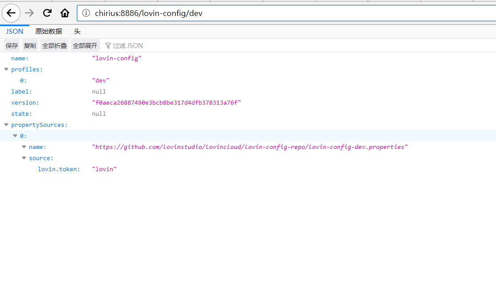

# lovinconfigserver 

* 一个解决分布式系统的配置管理方案。它包含了Client和Server两个部分，server提供配置文件的存储、以接口的形式将配置文件的内容提供出去，client通过接口获取数据、并依据此数据初始化自己的应用。默认为git作为配置仓库。

## git版本配置

```yaml
spring:
    cloud:
      config:
        server:
          git:
            uri: https://github.com/lovinstudio/lovincloud
            search-paths: lovin-config-repo
            username: #如果是私人仓库，还需要配置用户名，公共仓库可以省略
            password: #如果是私人仓库，还需要配置密码，公共仓库可以省略
        label: master
```
## svn版本配置

~~~yaml
spring:
  cloud:
    config:
      server:
        svn:
          uri: http://192.168.0.6/svn/repo/config-repo
          username: username
          password: password
        default-label: trunk
  profiles:
    active: subversion  #这里需要显式声明为subversion
~~~
同时还需要引入相应的配置：
~~~pom
        <!--SVN-->
        <dependency>
            <groupId>org.tmatesoft.svnkit</groupId>
            <artifactId>svnkit</artifactId>
        </dependency>
~~~
## 本地版本配置

~~~yaml
spring:
  cloud:
    config:
      server:
        native:
          searchLocations: file:D:\\config  #classpath:/config
  profiles:
    active: native  #native
~~~

## 下面是具体的截图：

* 访问地址：http://chirius:8886/lovin-config/dev。**这里有一点疑问，我通过http://chirius:8886/lovin-config/dev/去访问是一直不成功的，但是在换成其他github上面别人的配置仓库又是可以直接访问的**
* 结果原始数据：
~~~
{"name":"lovin-config","profiles":["dev"],"label":null,"version":"f0aeca26887490e3bcb8be317d4dfb378313a76f","state":null,"propertySources":[{"name":"https://github.com/lovinstudio/lovincloud/lovin-config-repo/lovin-config-dev.properties","source":{"lovin.token":"lovin"}}]}
~~~


~~~
2019-08-19 12:55:54.686  INFO 9256 --- [nio-8886-exec-4] o.s.c.c.s.e.NativeEnvironmentRepository  : Adding property source: file:/C:/Users/Chirius/AppData/Local/Temp/config-repo-8280352825025657146/lovin-config-repo/lovin-config-dev.properties
2019-08-19 12:55:57.560  INFO 9256 --- [nio-8886-exec-2] o.s.cloud.commons.util.InetUtils         : Cannot determine local hostname
2019-08-19 12:55:57.576  INFO 9256 --- [nio-8886-exec-2] o.s.c.c.s.e.NativeEnvironmentRepository  : Adding property source: file:/C:/Users/Chirius/AppData/Local/Temp/config-repo-8280352825025657146/lovin-config-repo/lovin-config-dev.properties
2019-08-19 12:56:00.544  INFO 9256 --- [nio-8886-exec-1] o.s.cloud.commons.util.InetUtils         : Cannot determine local hostname
2019-08-19 12:56:00.559  INFO 9256 --- [nio-8886-exec-1] o.s.c.c.s.e.NativeEnvironmentRepository  : Adding property source: file:/C:/Users/Chirius/AppData/Local/Temp/config-repo-8280352825025657146/lovin-config-repo/lovin-config-dev.properties
2019-08-19 12:56:07.136  INFO 9256 --- [trap-executor-0] c.n.d.s.r.aws.ConfigClusterResolver      : Resolving eureka endpoints via configuration
2019-08-19 13:01:07.140  INFO 9256 --- [trap-executor-0] c.n.d.s.r.aws.ConfigClusterResolver      : Resolving eureka endpoints via configuration
2019-08-19 13:06:07.142  INFO 9256 --- [trap-executor-0] c.n.d.s.r.aws.ConfigClusterResolver      : Resolving eureka endpoints via configuration
~~~

ps：通过日志我们可以看到配置文件是被保存在我们本地的，当然我们也就可以通过配置，修改保存的路径，具体配置为：**basedir**
