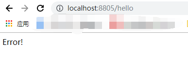
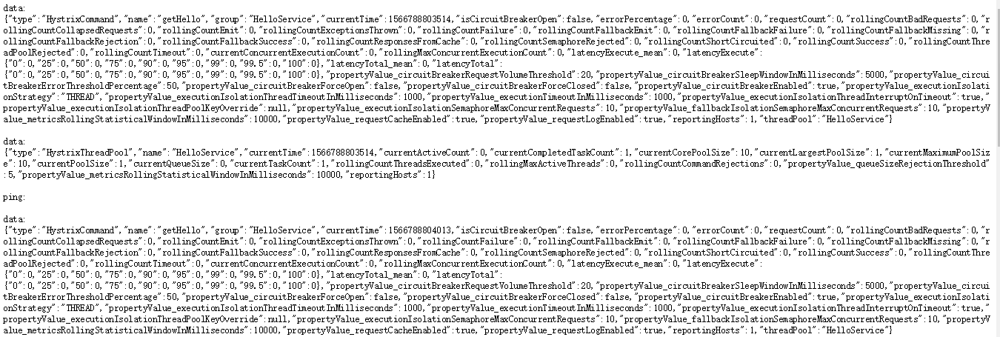
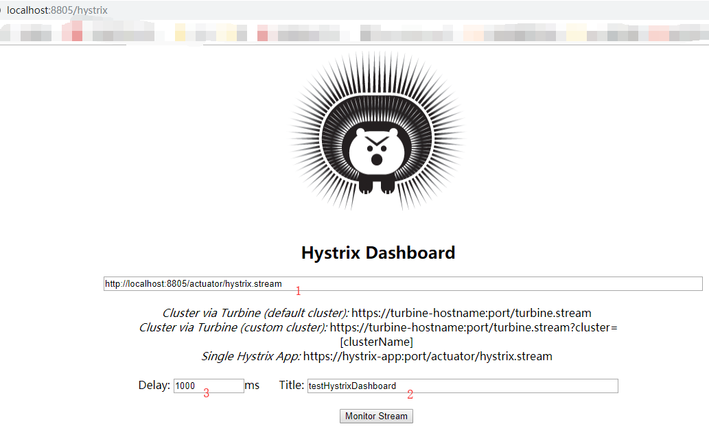
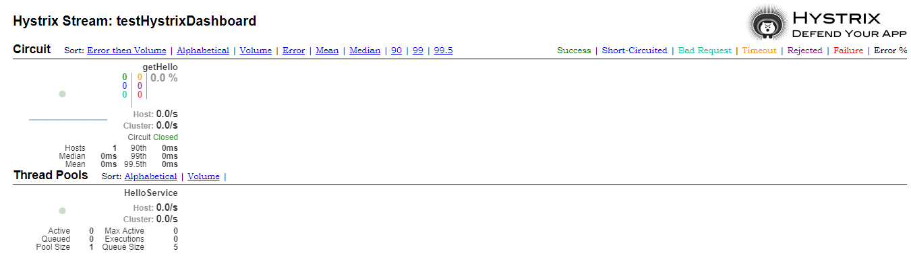
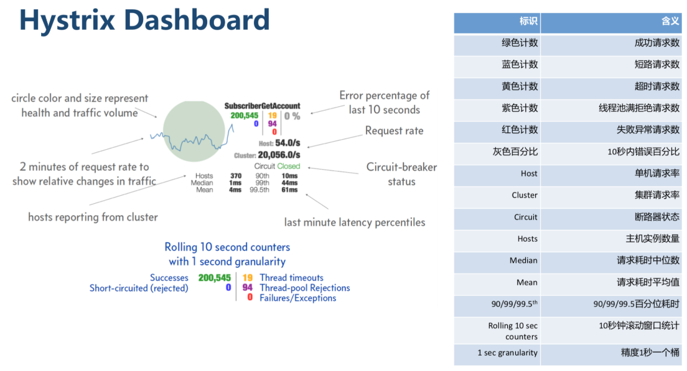

# lovinCloud 

* Ribbon+Hystrix的服务调用模块

**ribbon依赖**
```xml
<dependency>
    <groupId>org.springframework.cloud</groupId>
    <artifactId>spring-cloud-starter-netflix-ribbon</artifactId>
</dependency>       
```
**hystrix依赖**
```xml
<dependency>
    <groupId>org.springframework.cloud</groupId>
    <artifactId>spring-cloud-starter-hystrix</artifactId>
    <version>1.4.7.RELEASE</version>
</dependency>
```
1.在启动类中加入@EnableCircuitBreaker 或者 @EnableHystrix用于启用熔断器功能
```java
@SpringBootApplication
@EnableHystrix
@EnableDiscoveryClient
public class LovinRibbonClientApplication {

    public static void main(String[] args) {
        SpringApplication.run(LovinRibbonClientApplication.class,args);
    }

    @Bean
    @LoadBalanced
    RestTemplate restTemplate() {
        return new RestTemplate();
    }
}
```
2.为需要**容错**的方法添加@HystrixCommand注解，并使用fallbackMethod属性指定回退方法
```java
@Service
public class HelloService {
    @Autowired
    RestTemplate restTemplate;

    @HystrixCommand(fallbackMethod = "errorFallback")
    public String getHello() {
        return restTemplate.getForObject("http://lovineurkaclient/hello",String.class);
    }


    public String errorFallback() {
        return "Error!";
    }
}
```

可对@HystrixCommand 做如下配置使用Hystrix的信号模式(Semaphores)来隔离资源.

```java
@Service
public class HelloService {
    @Autowired
    RestTemplate restTemplate;

    @HystrixCommand(fallbackMethod = "errorFallback", 
        commandProperties = {
              @HystrixProperty(name="execution.isolation.strategy", value="SEMAPHORE")
            }
    )
    public String getHello() {
        return restTemplate.getForObject("http://lovineurkaclient/hello",String.class);
    }


    public String errorFallback() {
        return "Error!";
    }
}
```




* Ribbon+Hystrix+Dashboard监控服务调用情况

1.**添加actuator依赖**
```xml
<dependency>
    <groupId>org.springframework.boot</groupId>
    <artifactId>spring-boot-starter-actuator</artifactId>
</dependency>
```
2.加入依赖后，在yml中配置以下参数：
```yaml
management:
  endpoints:
    web:
      exposure:
        include: "*"
```
management.endpoints.web.exposure.include这个是用来暴露 endpoints 的。由于 endpoints 中会包含很多敏感信息，除了 health 和 info 两个支持 web 访问外，其他的默认不支持 web 访问。
Spring Boot的actuator（健康监控）功能提供了很多监控所需的接口，可以对应用系统进行配置查看、相关功能统计等，这里dashboard是需要依赖这个监控输出的json来生成可视化监控的

3.访问：http://localhost:8805/actuator/hystrix.stream
如果没有请求会一直显示 “ping”。这时候访问一下：http://localhost:8805/hello
会看到以下内容：



**添加hystrix-dashboard依赖**
```xml
<dependency>
    <groupId>org.springframework.cloud</groupId>
    <artifactId>spring-cloud-starter-hystrix-dashboard</artifactId>
    <version>1.3.1.RELEASE</version>
</dependency>
```
4.引入hystrix-dashboard包后，在启动类上加入注解@EnableHystrixDashboard开启监控面板

5.访问：http://localhost:8805/hystrix


其中：
   1. 监控服务的地址：http://localhost:8805/actuator/hystrix.stream
   2. 标题
   3. 轮询监控的延时时间

点击 Monitor Stream 按钮开启监控



