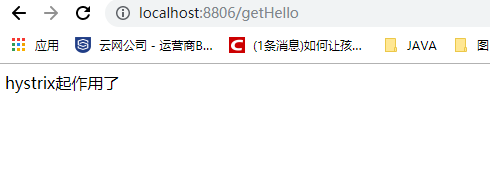

# lovinCloud 

* Ribbon+Hystrix的服务调用模块

**ribbon依赖**
```xml
<dependency>
    <groupId>org.springframework.cloud</groupId>
    <artifactId>spring-cloud-starter-netflix-ribbon</artifactId>
</dependency>       
```
**hystrix依赖**
```xml
<dependency>
    <groupId>org.springframework.cloud</groupId>
    <artifactId>spring-cloud-starter-hystrix</artifactId>
    <version>1.4.7.RELEASE</version>
</dependency>
```
1.在启动类中加入@EnableCircuitBreaker 或者 @EnableHystrix用于启用熔断器功能
```java
@SpringBootApplication
@EnableHystrix
@EnableDiscoveryClient
public class LovinRibbonClientApplication {

    public static void main(String[] args) {
        SpringApplication.run(LovinRibbonClientApplication.class,args);
    }

    @Bean
    @LoadBalanced
    RestTemplate restTemplate() {
        return new RestTemplate();
    }
}
```
2.为需要**容错**的方法添加@HystrixCommand注解，并使用fallbackMethod属性指定回退方法
```java
@Service
public class HelloService {
    @Autowired
    RestTemplate restTemplate;

    @HystrixCommand(fallbackMethod = "errorFallback")
    public String getHello() {
        return restTemplate.getForObject("http://lovineurkaclient/hello",String.class);
    }


    public String errorFallback() {
        return "Error!";
    }
}
```

可对@HystrixCommand 做如下配置使用Hystrix的信号模式(Semaphores)来隔离资源.

```java
@Service
public class HelloService {
    @Autowired
    RestTemplate restTemplate;

    @HystrixCommand(fallbackMethod = "errorFallback", 
        commandProperties = {
              @HystrixProperty(name="execution.isolation.strategy", value="SEMAPHORE")
            }
    )
    public String getHello() {
        return restTemplate.getForObject("http://lovineurkaclient/hello",String.class);
    }


    public String errorFallback() {
        return "Error!";
    }
}
```





